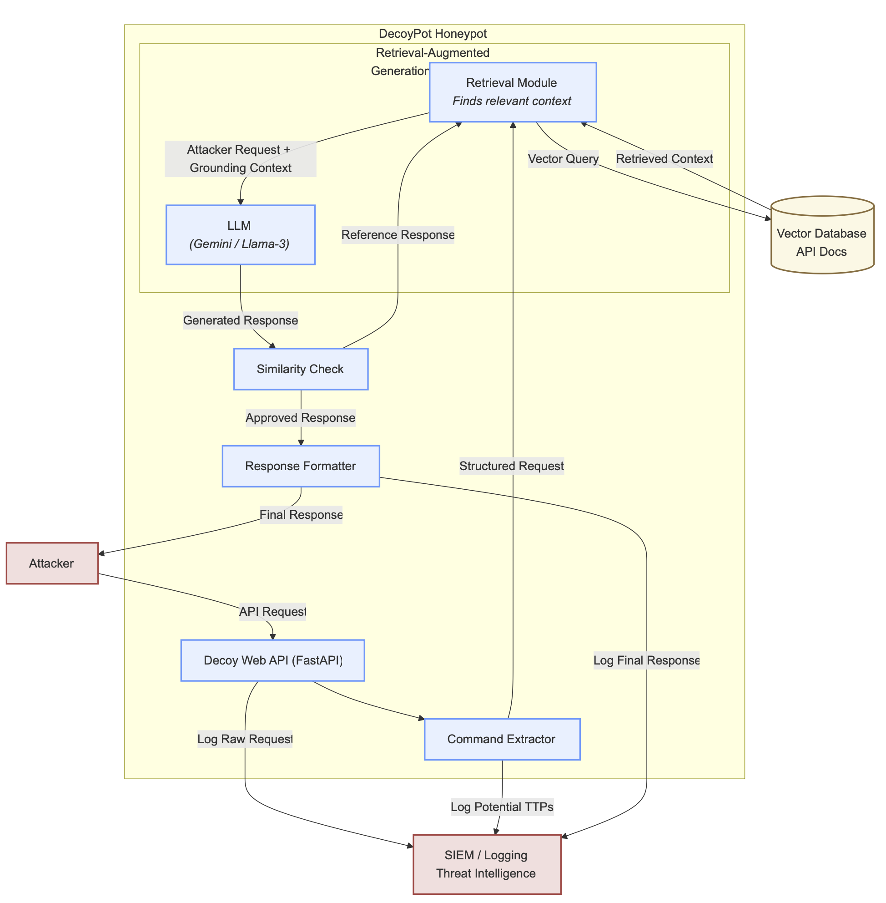

# 🛡️ DecoyPot: An LLM-Powered Web API Honeypot


A modern, high-interaction, AI-driven Web API honeypot designed to realistically engage and analyze sophisticated attackers. This project is the implementation of the research paper: *"DecoyPot: A large language model-driven web API honeypot for realistic attacker engagement"* \cite{sezgin2025decoypot}.

---

## 📖 Table of Contents

- [The Problem](#-the-problem)
- [Our Solution: DecoyPot](#-our-solution-decoypot)
- [Core Features](#-core-features)
- [System Architecture](#-system-architecture)
- [Technology Stack](#-technology-stack)
- [Getting Started](#-getting-started)
  - [Prerequisites](#prerequisites)
  - [Installation & Setup](#installation--setup)
- [Usage](#-usage)
  - [1. Build the Knowledge Base](#1-build-the-knowledge-base)
  - [2. Run the Honeypot Server](#2-run-the-honeypot-server)
  - [3. Launch the Dashboard](#3-launch-the-dashboard)
- [Project Structure](#-project-structure)
- [The Team](#-the-team)
- [Citation](#-citation)
- [License](#-license)

---

## 🎯 The Problem

Traditional honeypots are static and predictable. They use pre-scripted, canned responses that are easily identified by sophisticated adversaries (like APT groups). As a result, they fail to engage the very attackers we want to study, limiting the quality of the threat intelligence we can gather. There is a need for a dynamic decoy that can generate believable, context-aware responses on the fly.

## 💡 Our Solution: DecoyPot

DecoyPot is a next-generation honeypot that uses a **Large Language Model (LLM)** as its "brain" to create a dynamic and believable decoy. To solve the problem of LLM "hallucinations," DecoyPot is built on a **Retrieval-Augmented Generation (RAG)** framework. This grounds the LLM in the real documentation of the API it's mimicking, ensuring all responses are not only plausible but also structurally and semantically correct.

The goal is to create a decoy so realistic that it can:
1.  **Engage** sophisticated attackers for prolonged periods.
2.  **Capture** their Tactics, Techniques, and Procedures (TTPs).
3.  **Generate** high-quality, actionable Cyber Threat Intelligence (CTI).

## ✨ Core Features

*   **🧠 Dynamic Response Generation:** Uses an LLM (e.g., Google Gemini, Llama-3) to generate unique, context-aware API responses in real-time.
*   **📚 RAG for Accuracy:** Grounds the LLM in real API documentation (OpenAPI/Swagger specs) to prevent hallucinations and ensure responses adhere to the correct schema.
*   **📊 Live Threat Intelligence Dashboard:** A real-time dashboard built with Streamlit to visualize attacker activity, including geographic locations and most targeted endpoints.
*   **📦 Modular and Scalable:** Designed with a clean, separated architecture to be easily extended and maintained.

## 🏗️ System Architecture

The DecoyPot system follows a RAG pipeline to process incoming requests and generate high-fidelity responses.



## 🛠️ Technology Stack

| Category | Technology |
| :--- | :--- |
| **Backend** | Python 3.10+, FastAPI |
| **AI / ML** | Google Gemini API, Hugging Face `transformers`, `sentence-transformers`, `peft`, `bitsandbytes`, PyTorch |
| **Vector Search** | FAISS (Facebook AI Similarity Search) |
| **Dashboard** | Streamlit, Pandas |
| **Environment** | `uv` (Python Package Manager) |

## 🚀 Getting Started

Follow these steps to get a working MVP of the DecoyPot system running locally.

### Prerequisites

*   Python 3.10 or higher
*   `git` for cloning the repository
*   `uv` Python package manager (`pip install uv`)
*   A **Google Gemini API Key** from [Google AI Studio](https://aistudio.google.com/app/apikey).

### Installation & Setup

1.  **Clone the repository:**
    ```bash
    git clone [Your-Repository-URL]
    cd decoypot_project
    ```

2.  **Create and sync the virtual environment:**
    `uv` will automatically create a `.venv` folder and install all the exact package versions from the `uv.lock` file.
    ```bash
    uv sync
    ```

3.  **Activate the environment:**
    *   **macOS / Linux:** `source .venv/bin/activate`
    *   **Windows:** `.venv\Scripts\activate`

4.  **Configure your API Key:**
    Create a file named `.env` in the root of the project. **This file is git-ignored and must not be shared.**
    ```    # .env
    GOOGLE_API_KEY="YOUR_GEMINI_API_KEY_HERE"
    ```

## ⚙️ Usage

The project is run in three distinct steps. The server and dashboard should be run in separate terminals.

### 1. Build the Knowledge Base

This is a **one-time step** you must run first. This script reads the API documentation from the `/data` folder and builds the searchable FAISS index.

```bash
python scripts/ingest.py
```
This will create the necessary index files in the `/knowledge_base` directory.

### 2. Run the Honeypot Server

This command starts the main FastAPI server. This is the live honeypot.

```bash
uvicorn server.main:app --reload
```
The server will be running on `http://localhost:8000`.

### 3. Launch the Dashboard

In a **new terminal**, activate the environment again and run the Streamlit dashboard.

```bash
streamlit run dashboard/app.py
```
Your browser will open with the live threat intelligence dashboard, which will auto-refresh as the honeypot receives traffic.

---

## 📂 Project Structure

```
decoypot_project/
├── data/              # Raw OpenAPI/Swagger specification files
├── knowledge_base/    # Stores the generated FAISS index
├── logs/              # Contains the structured JSONL logs
├── scripts/           # One-time scripts (e.g., ingest.py)
├── server/            # The core FastAPI honeypot application
├── dashboard/         # The Streamlit dashboard application
├── finetuning/        # Post-MVP: Scripts for fine-tuning a local LLM
├── .env               # Secret API keys (git-ignored)
├── .gitignore         # Files to be ignored by Git
├── pyproject.toml     # Project dependencies
└── README.md          # You are here!
```

---

## 👥 The Team

*   **Lead A:** RAG & Data Specialist
*   **Lead B:** Decoy Server & LLM Specialist
*   **Lead C:** Intelligence & UI Specialist
*   **Lead D:** Project Lead & ML Engineer

---

## 📜 Citation

This project is an implementation based on the following research paper:
> Sezgin, A., & Boyacı, A. (2025). DecoyPot: A large language model-driven web API honeypot for realistic attacker engagement. *Computers & Security*, *154*, 104458.

---

## ⚖️ License

This project is licensed under the MIT License. See the `LICENSE` file for details.
